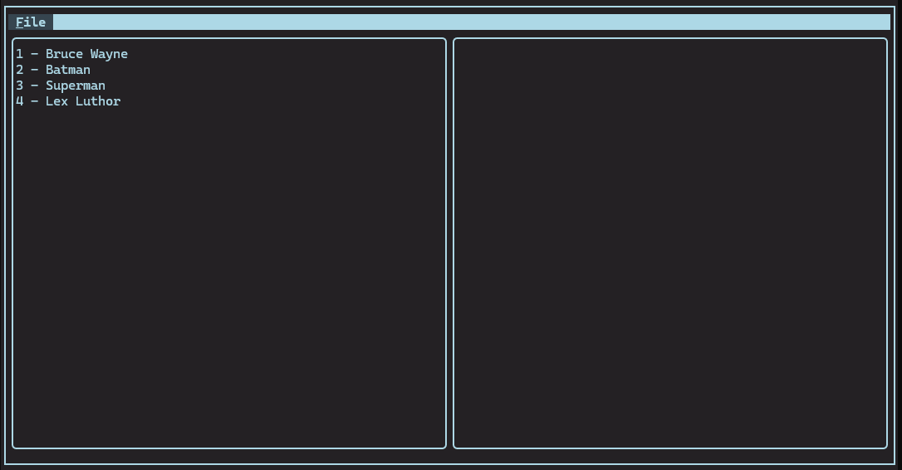
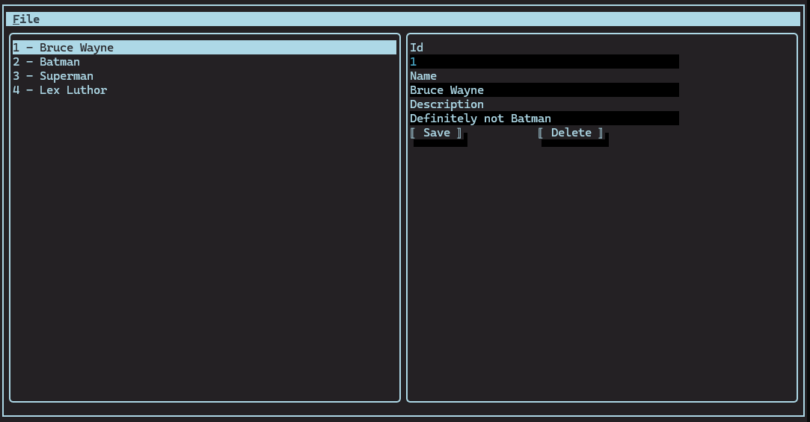
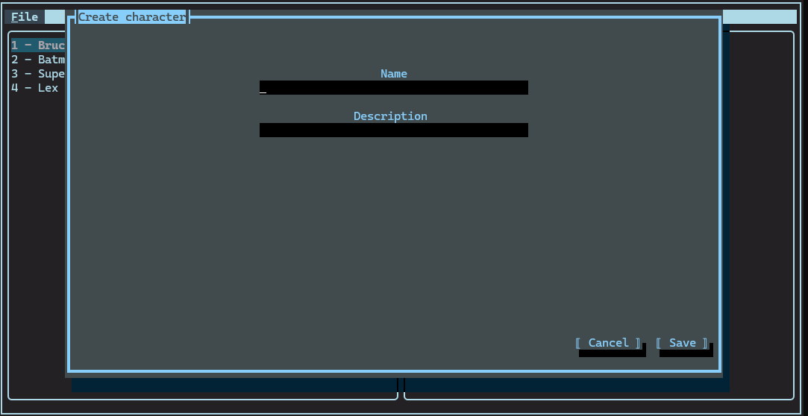

# Končar interview project

## Opis rješenja
Zadatak je riješen implementacijom REST API-ja kao serverske aplikacije te TUI [^1] klijentske aplikacije.
Serverska aplikacija (Koncar.Interview.Server koja se nalazi u mapi [server](https://github.com/TiHedzet/koncar-interview/tree/master/server)) komunicira s bazom podataka [^2] koristeći Entity Framework Core biblioteku. U svrhu modularnije podjele koda prati se arhitekturalni obrazac vetical slice architecture uz pomoć MediatR biblioteke (verzije 12.5 pošto se od verzije 13 biblioteka naplaćuje). Klijentska aplikacija realizirana je kao TUI koristeći Terminal.Gui biblioteku i model-view-presenter arhitekturu. Komunikacija sa serverskom aplikacijom implementirana je koristeći HttpClient. I serverska i klijentska aplikacija logiraju promet i greške. Konekcijski string za bazu pohranjen je u appsettings.json datoteci zbog jednostavnosti. Kako bi se izbjeglo pokretanje migracija prilikom pokretanja serverske aplikacije u repozitoriju se nalazi i mala konzolna aplikacija koja pokreće migracije (pokretanjem baze pokreće se i konzolna aplikacija).

## Kratke upute za korištenje klijentske aplikacije
Klijentska aplikacija je poprilično jednostavna. Podržava kreiranje (izbornik File->Create) likova, s lijeve strane prikazuje listu svih likova. Odabirom (mišem ili tipkovnicom) nekog elementa u listi svih likova s desne strane pojavljuje se detaljan pogled iz kojeg je moguće urediti ili obrisati lika.
Pritiskom tipke F5 osvježava se popis likova (pošto je u zadatku navedeno kako je potrebno pokrenuti više klijentskih aplikacija, tako osiguravamo da su dostupni svi podatci).
Pritiskom tipki Ctrl+c možemo prekinuti izvršavanje trenutne naredbe.

## Primjeri klijentske aplikacije
Slijedi primjer izleda klijentske aplikacije nakon pokretanja[^3]:

Nakon odabira nekog reda vidljivi su detalji o odabranom liku:

Novi lik se kreira odabirom Create opcije u File izborniku, te se prikazuje sljedeči pogled:

## Napomene
Logovi serverske aplikacije nalaze se u Logs mapi u mapi starter projekta [Starter](https://github.com/TiHedzet/koncar-interview/tree/master/server/src/Koncar.Interview.Server.Starter).
Logovi klijentske aplikacije nalaze se u mapi gdje se nalazi izvršna datoteka aplikacije nakon pokretanja (client/src/Koncar.Interview.Client.Starter/bin/Debug/net10.0/Logs).

## Upute za pokretanje
Prvo se mora pokenuti Docker container u kojem se nalaze PostgreSQL baza i projekt koji izvršava migracije.
Serverska i klijentska aplikacija mogu se pokrenuti iz Visual Studija.
Ukoliko je potrebno, moguće je priložiti docker-compose u kojem se pokreće i serverska aplikacija zajedno s bazom podataka.

[^1]: TUI u smislu skraćenice terminal user interface.
[^2]: Baza podataka pokreće se naredbom docker compose up u vršnoj mapi repozitorija, gdje se nalazi i sama docker-compose.yaml datoteka.
[^3]: Baza podataka je inicijalno prazna, primjeri su napravljeni kreiranjem likova korištenjem klijentske aplikacije.